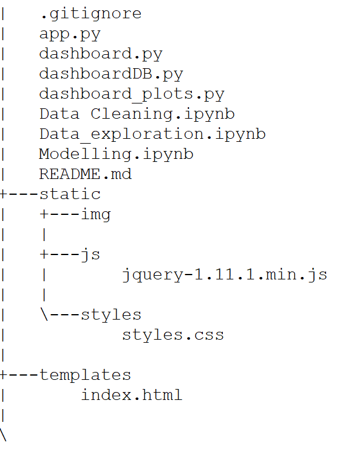

# EUROCONSULT

**Mahshid AMIR MOAZAMI & Matthieu COGET**

*Data Analytics full-time Paris Jan 2021*

## Overview

Two projects were proposed by Euroconsult, which is a consulting firm specialized in space markets. 

* The first was the creation of an interactive dashboard to have an overview on the satellites activities and budget for every country.
* The second project was the modelling of the budget on satellites per country for the next 10 years from the budgets for the last 22 years.

Two datasets were provided by Euroconsult and were cleaned. Some adaptations were needed (data aggregation, pivot table).

* Datasets provided were:
	* Satellites
		- Launched from 2009  to to be launched by 2028.
		- Application
		- Launch status
		- Range of price
	* Budget by country
		- Year
		- Application
		- Civil or defence

The budget dataset was composed of 97,459 rows and 10 columns with 2 numeric columns, the rest were objects.
The satellites dataset was composed of 2,500 rows and 9 columns with 1 numeric column (dates), the rest were objects. Two columns were price range and weight range of the satellites, so it easily became dummies.

### Libraries used:

Pandas, Numpy, Matplotlib.pyplot, Seaborn

* For the dashboard:
	* Plotly (an interactive graphing library for Python)
	* Flask (a micro web framework written in Python)
* For the :
	* Sklearn (a machine learning library for Python)


### Model Training and Evaluation

* Train your ML model, produce results, and evaluate.
* This is an iterative process. Try your best to improve your model performance by:
	* More data cleaning.
	* Try different models and select one that is the simplest yet produce the best result.
	* Try advanced techniques and see if they improve the result.
    
### Dashboard

#### Usage

```bash
$ python app.py
 * Running on http://0.0.0.0:9999/ (Press CTRL+C to quit)
 * Restarting with stat
```


## Organization
In repository of project you find:



## Conclusion

* Summarize your data analysis result.
* State your conclusion of your hypothesis testing.
* Interpret your findings in terms of the human-understandable question you try to answer.
* What are the next steps?

